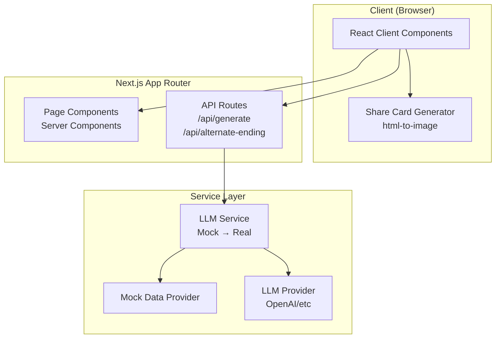
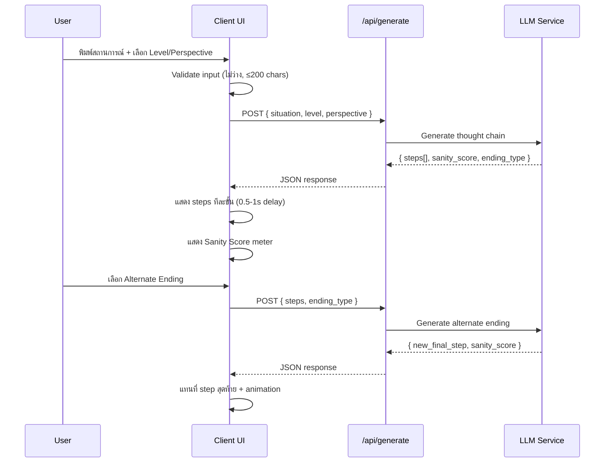

# Design Document: Overthink Simulator

## Overview

Overthink Simulator เป็น Web App ที่ผู้ใช้พิมพ์สถานการณ์สั้นๆ แล้วระบบจะสร้าง "สายโซ่ความคิดมากเกินไป" (Thought Chain) ที่ค่อยๆ ไต่ระดับจากสมเหตุสมผลไปจนถึงไร้สาระ โดยมี 6 บุคลิกผู้พูด (Perspective Mode) และ 5 ระดับความคิดมาก (Overthink Level)

สถาปัตยกรรมหลักใช้ Next.js App Router เป็น full-stack framework โดย frontend ใช้ React Server Components + Client Components ร่วมกับ TailwindCSS สำหรับ styling และ backend ใช้ API Routes สำหรับ LLM integration เริ่มต้นด้วย mock data แล้วค่อยเชื่อมต่อ LLM จริงภายหลัง

### เป้าหมายหลักทางเทคนิค
- Mobile-first responsive design (375px - 1024px+)
- Mock-first development: UI ทำงานได้ครบก่อนเชื่อม LLM
- Real-time animation: แสดง thought steps ทีละขั้นด้วย delay 0.5-1s
- Share card generation: สร้างภาพจาก Thought Chain สำหรับแชร์โซเชียล

## Architecture

### High-Level Architecture



### Application Flow



### Directory Structure

```
app/
├── layout.tsx                  # Root layout + TailwindCSS + fonts
├── page.tsx                    # หน้าหลัก (Server Component)
├── globals.css                 # Tailwind directives + custom animations
├── api/
│   ├── generate/route.ts       # POST: สร้าง Thought Chain
│   └── alternate-ending/route.ts # POST: สร้าง Alternate Ending
├── components/
│   ├── SituationInput.tsx      # Input form + validation
│   ├── OverthinkLevelSelector.tsx # 5-level selector
│   ├── PerspectiveSelector.tsx # 6 persona selector
│   ├── ThoughtChain.tsx        # Thought chain visualization + animation
│   ├── SanityMeter.tsx         # Sanity score progress bar
│   ├── AlternateEndings.tsx    # 3 ending options
│   ├── ShareCard.tsx           # Share card generator + download/copy
│   └── TriggerTemplates.tsx    # Preset situation buttons
├── lib/
│   ├── llm-service.ts          # LLM service abstraction
│   ├── mock-data.ts            # Mock responses
│   ├── types.ts                # TypeScript types
│   └── validators.ts           # Input validation utilities
└── hooks/
    └── useThoughtAnimation.ts  # Animation timing hook
```

## Components and Interfaces

### 1. SituationInput Component

Client Component ที่จัดการ input สถานการณ์จากผู้ใช้

```typescript
// Props
interface SituationInputProps {
  onSubmit: (situation: string) => void;
  isLoading: boolean;
  defaultValue?: string;
}

// Behavior:
// - แสดง textarea พร้อม character counter (max 200)
// - Validate: ไม่ว่าง, ไม่เกิน 200 ตัวอักษร
// - แสดง error message เมื่อ input ไม่ถูกต้อง
// - Disable submit ขณะ loading
```

### 2. OverthinkLevelSelector Component

Client Component สำหรับเลือกระดับความคิดมาก

```typescript
interface OverthinkLevelSelectorProps {
  value: OverthinkLevel;
  onChange: (level: OverthinkLevel) => void;
}

// แสดง 5 ระดับเป็น radio/button group:
// 1: "Reasonable human"
// 2: "Slight worrier"
// 3: "Full overthinker"
// 4: "Anxiety master"
// 5: "Meme/chaos"
```

### 3. PerspectiveSelector Component

Client Component สำหรับเลือกบุคลิกผู้พูด

```typescript
interface PerspectiveSelectorProps {
  value: PerspectiveMode;
  onChange: (mode: PerspectiveMode) => void;
}

// แสดง 6 personas เป็น selectable cards:
// "psychologist" | "doom_thinker" | "gen_z" | "gen_alpha" | "anime_protagonist" | "thai_mom"
```

### 4. ThoughtChain Component

Client Component หลักที่แสดง thought steps พร้อม animation

```typescript
interface ThoughtChainProps {
  steps: string[];
  isAnimating: boolean;
  visibleStepCount: number;
}

// Behavior:
// - แสดง steps ทีละขั้นตาม visibleStepCount
// - เชื่อมต่อด้วยลูกศร ↓
// - แสดง "thought forming" animation สำหรับ step ถัดไป
// - Scroll to latest step อัตโนมัติ
```

### 5. SanityMeter Component

Client Component แสดง Sanity Score

```typescript
interface SanityMeterProps {
  score: number; // 0-100
  visible: boolean;
}

// แสดง progress bar + ตัวเลข %
// สีเปลี่ยนตาม score: เขียว (80-100) → เหลือง (40-79) → แดง (0-39)
```

### 6. AlternateEndings Component

Client Component สำหรับเลือกตอนจบทางเลือก

```typescript
interface AlternateEndingsProps {
  onSelect: (endingType: EndingType) => void;
  isLoading: boolean;
  visible: boolean;
}

// 3 ปุ่ม: "Worst ending", "Best ending", "Delusional ending"
// แสดงหลังจาก Thought Chain แสดงผลครบ
```

### 7. ShareCard Component

Client Component สำหรับสร้างและแชร์ภาพ

```typescript
interface ShareCardProps {
  situation: string;
  steps: string[];
  sanityScore: number;
  visible: boolean;
}

// Behavior:
// - Render card preview ในรูปแบบ [situation] ↓ Step 1: [text] ↓ ... ↓ Sanity: XX%
// - ปุ่ม "Download image": ใช้ html-to-image สร้าง PNG
// - ปุ่ม "Copy for social": คัดลอกข้อความไป clipboard
```

### 8. TriggerTemplates Component

Client Component แสดงปุ่มสถานการณ์สำเร็จรูป

```typescript
interface TriggerTemplatesProps {
  onSelect: (template: string) => void;
}

// แสดงปุ่มอย่างน้อย 3 สถานการณ์:
// - "เขาไม่ตอบแชท"
// - "สอบใกล้แล้วแต่ยังไม่อ่าน"
// - "หัวหน้าเรียกคุย"
// กดแล้วเติมข้อความลง input แต่ไม่ submit อัตโนมัติ
```

### 9. API Routes

```typescript
// POST /api/generate
interface GenerateRequest {
  situation: string;
  level: OverthinkLevel;
  perspective: PerspectiveMode;
}

interface GenerateResponse {
  steps: string[];
  sanity_score: number;
  ending_type: "normal";
}

// POST /api/alternate-ending
interface AlternateEndingRequest {
  situation: string;
  steps: string[];
  level: OverthinkLevel;
  perspective: PerspectiveMode;
  ending_type: EndingType;
}

interface AlternateEndingResponse {
  new_final_step: string;
  sanity_score: number;
  ending_type: EndingType;
}
```

### 10. LLM Service

```typescript
// lib/llm-service.ts
interface LLMService {
  generateThoughtChain(params: GenerateRequest): Promise<GenerateResponse>;
  generateAlternateEnding(params: AlternateEndingRequest): Promise<AlternateEndingResponse>;
}

// Strategy pattern: สลับระหว่าง MockLLMService กับ RealLLMService
// ผ่าน environment variable USE_MOCK_LLM=true/false
```

### 11. useThoughtAnimation Hook

```typescript
function useThoughtAnimation(steps: string[], options?: {
  delayMs?: number; // default: 700ms (ระหว่าง 500-1000)
}): {
  visibleStepCount: number;
  isAnimating: boolean;
  isComplete: boolean;
  reset: () => void;
};
```

## Data Models

### Core Types

```typescript
// lib/types.ts

type OverthinkLevel = 1 | 2 | 3 | 4 | 5;

type PerspectiveMode =
  | "psychologist"
  | "doom_thinker"
  | "gen_z"
  | "gen_alpha"
  | "anime_protagonist"
  | "thai_mom";

type EndingType = "worst" | "best" | "delusional";

interface ThoughtStep {
  index: number;
  text: string;
}

interface ThoughtChainResult {
  situation: string;
  level: OverthinkLevel;
  perspective: PerspectiveMode;
  steps: string[];
  sanity_score: number;
  ending_type: "normal" | EndingType;
}

interface TriggerTemplate {
  id: string;
  label: string;
  situation: string;
}
```

### LLM Prompt Structure

```typescript
interface LLMPromptParams {
  situation: string;
  level: OverthinkLevel;
  perspective: PerspectiveMode;
  ending_type?: EndingType;
}

// Level mapping สำหรับ prompt:
const LEVEL_DESCRIPTORS: Record<OverthinkLevel, { tone: string; conclusion: string }> = {
  1: { tone: "calm and rational", conclusion: "logical" },
  2: { tone: "slightly worried", conclusion: "logical with mild concern" },
  3: { tone: "anxious and spiraling", conclusion: "emotional" },
  4: { tone: "extreme anxiety", conclusion: "deeply emotional" },
  5: { tone: "completely unhinged and absurd", conclusion: "absurd/meme" },
};

// Perspective mapping สำหรับ prompt:
const PERSPECTIVE_DESCRIPTORS: Record<PerspectiveMode, string> = {
  psychologist: "a clinical psychologist analyzing the situation",
  doom_thinker: "a pessimist who always expects the worst",
  gen_z: "a Gen Z person using internet slang and memes",
  gen_alpha: "a Gen Alpha kid with iPad brain",
  anime_protagonist: "an anime protagonist with dramatic inner monologue",
  thai_mom: "a Thai mom who worries about everything",
};
```

### Mock Data Structure

```typescript
// lib/mock-data.ts
// Pre-defined responses สำหรับ development
// จัดกลุ่มตาม situation keyword + level + perspective
// ใช้ random selection เมื่อไม่มี exact match

interface MockResponse {
  keywords: string[];
  level: OverthinkLevel;
  perspective: PerspectiveMode;
  response: GenerateResponse;
}
```

### Sanity Score Calculation

```typescript
// Sanity score ลดลงตาม level:
// Level 1: 80-100
// Level 2: 60-80
// Level 3: 40-60
// Level 4: 20-40
// Level 5: 0-20
// Mock data ใช้ค่าสุ่มในช่วงนี้, LLM จริงจะคำนวณเอง
```


## Correctness Properties

*A property is a characteristic or behavior that should hold true across all valid executions of a system — essentially, a formal statement about what the system should do. Properties serve as the bridge between human-readable specifications and machine-verifiable correctness guarantees.*

### Property 1: Input validation rejects invalid inputs

*For any* input string, the validation function should accept it if and only if it is non-empty (not composed entirely of whitespace) AND has length ≤ 200 characters. Any whitespace-only string or string exceeding 200 characters should be rejected, and the system state should remain unchanged.

**Validates: Requirements 1.3, 1.4**

### Property 2: Overthink level maps to correct conclusion type

*For any* OverthinkLevel value, the level-to-conclusion mapping should produce: "logical" for levels 1-2, "emotional" for levels 3-4, and "absurd" for level 5. The prompt parameters (tone and conclusion descriptors) must correspond to the selected level.

**Validates: Requirements 2.2, 2.3, 2.4, 2.5**

### Property 3: Thought chain rendering structure

*For any* ThoughtChainResult with N steps (N ≥ 1), the rendered output should contain exactly N step elements and exactly N-1 arrow connectors between them.

**Validates: Requirements 3.1, 3.2**

### Property 4: Perspective mode included in prompt

*For any* valid PerspectiveMode selection, the structured prompt sent to LLM_Service should include the corresponding perspective descriptor string from the PERSPECTIVE_DESCRIPTORS mapping.

**Validates: Requirements 4.2**

### Property 5: Animation step timing

*For any* thought chain with N steps, the useThoughtAnimation hook should increment visibleStepCount from 0 to N, with each increment delayed between 500ms and 1000ms. After all steps are visible, isComplete should be true and isAnimating should be false.

**Validates: Requirements 5.1**

### Property 6: Share card contains all required content

*For any* ThoughtChainResult, the generated share card text should contain: the original situation string, each step prefixed with "Step {index}:", and the sanity score formatted as "Sanity: XX%".

**Validates: Requirements 6.2**

### Property 7: Trigger template populates input without submitting

*For any* TriggerTemplate, clicking it should set the input field value to the template's situation text, and should NOT trigger a Thought_Chain generation request.

**Validates: Requirements 7.2, 7.3**

### Property 8: Alternate ending replaces only the last step

*For any* ThoughtChainResult and any EndingType selection, after receiving an alternate ending response, the displayed steps should be identical to the original steps except the last one, which should be replaced with the new_final_step from the response.

**Validates: Requirements 8.2, 8.3**

### Property 9: LLM Service API contract

*For any* valid combination of situation (non-empty, ≤200 chars), OverthinkLevel (1-5), and PerspectiveMode (one of 6 values), the LLM_Service should receive all three parameters in the structured prompt and return a response conforming to the schema: steps (non-empty string array), sanity_score (number 0-100), ending_type (valid string).

**Validates: Requirements 9.1, 9.2**

### Property 10: Error responses show retry option

*For any* error returned by LLM_Service, the UI should display an error message and the submit/retry button should remain enabled (not stuck in loading state).

**Validates: Requirements 9.4**

## Error Handling

### Client-Side Errors

| Error | Handling |
|-------|----------|
| Input ว่างหรือ whitespace-only | แสดง inline error "กรุณาพิมพ์สถานการณ์ก่อนนะ" ใต้ input field |
| Input เกิน 200 ตัวอักษร | ป้องกันการพิมพ์เกิน + แสดง character counter เป็นสีแดง |
| Share card generation ล้มเหลว | แสดง toast notification "ไม่สามารถสร้างภาพได้ ลองใหม่อีกครั้ง" |
| Clipboard copy ล้มเหลว | Fallback: แสดง modal พร้อมข้อความให้ copy เอง |

### API Errors

| Error | Handling |
|-------|----------|
| LLM_Service timeout (>15s) | แสดง "ระบบตอบช้า ลองใหม่อีกครั้ง" + ปุ่ม retry |
| LLM_Service 500 error | แสดง "เกิดข้อผิดพลาด ลองใหม่อีกครั้ง" + ปุ่ม retry |
| LLM_Service invalid response format | Fallback ไปใช้ mock data + แสดง subtle warning |
| Network error | แสดง "ไม่สามารถเชื่อมต่อได้ ตรวจสอบอินเทอร์เน็ต" |

### API Route Validation

- Validate request body schema ด้วย Zod
- Return 400 สำหรับ invalid request format
- Return 500 สำหรับ internal errors พร้อม generic error message (ไม่ expose internal details)
- Rate limiting: ไม่จำเป็นในเฟสแรก แต่ควรเพิ่มเมื่อเชื่อม LLM จริง

## Testing Strategy

### Testing Framework

- **Unit/Integration Tests**: Vitest + React Testing Library
- **Property-Based Tests**: fast-check (ร่วมกับ Vitest)
- **E2E Tests** (optional, ไม่อยู่ใน scope แรก): Playwright

### Unit Tests

Unit tests สำหรับ specific examples, edge cases และ error conditions:

- **Input validation**: ทดสอบ empty string, whitespace strings, exactly 200 chars, 201 chars, special characters
- **Level mapping**: ทดสอบแต่ละ level ว่า map ไปยัง tone/conclusion ที่ถูกต้อง
- **Perspective mapping**: ทดสอบแต่ละ perspective ว่า map ไปยัง descriptor ที่ถูกต้อง
- **Mock data**: ทดสอบว่า mock service return valid response format
- **API routes**: ทดสอบ request validation, error responses
- **Share card text**: ทดสอบ format output สำหรับ specific examples
- **Sanity score display**: ทดสอบ color mapping (green/yellow/red)

### Property-Based Tests

Property-based tests ใช้ fast-check สำหรับ universal properties ที่ต้อง hold สำหรับ all valid inputs:

- ทุก property test ต้องรัน minimum 100 iterations
- ทุก property test ต้องมี comment อ้างอิง design property
- Tag format: `Feature: overthink-simulator, Property {number}: {property_text}`

**Properties ที่ต้อง implement:**

1. **Property 1**: Input validation - generate random strings, verify accept/reject ตาม rules
2. **Property 2**: Level mapping - generate random OverthinkLevel, verify correct conclusion type
3. **Property 3**: Thought chain structure - generate random step arrays, verify rendering element count
4. **Property 4**: Perspective prompt - generate random PerspectiveMode, verify descriptor inclusion
5. **Property 5**: Animation timing - generate random step counts, verify hook behavior
6. **Property 6**: Share card content - generate random ThoughtChainResult, verify all fields present
7. **Property 7**: Trigger template behavior - generate random templates, verify input population without submit
8. **Property 8**: Alternate ending replacement - generate random chains + endings, verify only last step changes
9. **Property 9**: API contract - generate random valid inputs, verify request/response schema
10. **Property 10**: Error handling - generate random error types, verify retry availability

### Test Organization

```
__tests__/
├── unit/
│   ├── validators.test.ts
│   ├── level-mapping.test.ts
│   ├── perspective-mapping.test.ts
│   ├── mock-data.test.ts
│   └── api-routes.test.ts
├── property/
│   ├── input-validation.property.test.ts
│   ├── level-mapping.property.test.ts
│   ├── thought-chain.property.test.ts
│   ├── perspective-prompt.property.test.ts
│   ├── animation-timing.property.test.ts
│   ├── share-card.property.test.ts
│   ├── trigger-template.property.test.ts
│   ├── alternate-ending.property.test.ts
│   ├── api-contract.property.test.ts
│   └── error-handling.property.test.ts
└── components/
    ├── SituationInput.test.tsx
    ├── ThoughtChain.test.tsx
    └── ShareCard.test.tsx
```

### Key Dependencies

| Package | Purpose |
|---------|---------|
| next | App Router framework |
| react, react-dom | UI library |
| tailwindcss | Styling |
| html-to-image | Share card image generation |
| zod | API request/response validation |
| vitest | Test runner |
| @testing-library/react | Component testing |
| fast-check | Property-based testing |
